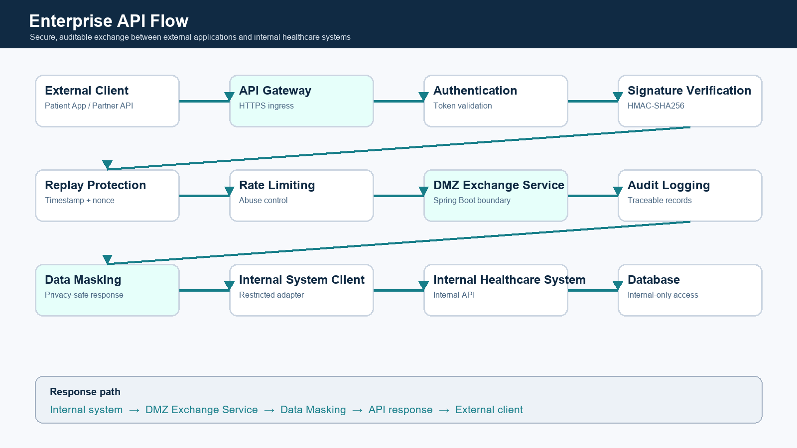
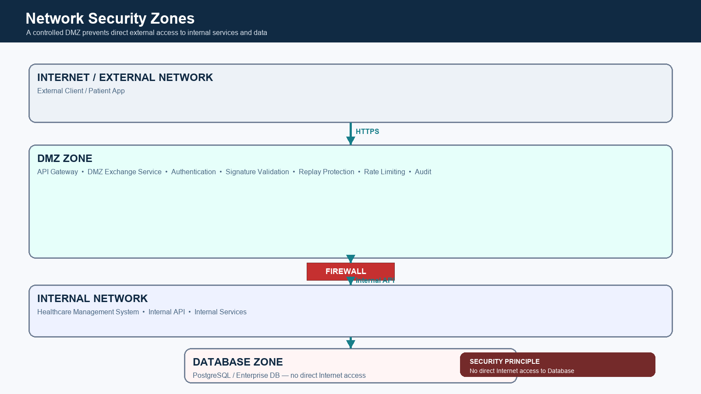

# Enterprise Data Exchange Gateway

> Secure enterprise data exchange service for external-to-internal system integration, built with Spring Boot, Redis, Docker, and API security controls.

## Portfolio highlights

- HMAC-SHA256 request signing, timestamp checks, nonce replay protection, and JWT authentication.
- DMZ boundary, audited internal-system adapter, and privacy-safe patient data masking.
- Maven tests, GitHub Actions CI, Docker Compose deployment, and demo-only healthcare data.






## Secure API Integration Platform for Enterprise Systems


Enterprise Data Exchange Gateway is a secure enterprise integration platform designed to connect external applications with internal business systems through controlled, auditable, and secure API communication.


The platform provides:

- API Gateway capabilities
- DMZ-based secure exchange architecture
- Authentication and authorization
- API signature verification
- Data transformation
- Audit logging
- Enterprise system integration


---

# Business Scenario


Modern enterprises often need to connect:


```
External Applications

        |

        |

Secure API Gateway

        |

        |

Internal Enterprise Systems

```


Typical scenarios:


- Mobile application integration
- Partner API integration
- Healthcare information exchange
- Enterprise system interoperability
- Secure data synchronization


---

# Key Features


## 1. Enterprise API Gateway


Provides unified API access:


- Request routing
- Authentication
- Rate limiting
- API management
- Error handling


---


## 2. DMZ Security Exchange Architecture


Designed for enterprise network isolation.


Architecture:


```
Internet

   |

HTTPS

   |

DMZ Gateway

   |

Exchange Service

   |

Internal Business APIs

   |

Database

```


Security principles:


- External systems cannot directly access internal systems
- DMZ layer controls all external communication
- Database access is restricted to internal services


---


## 3. Secure Authentication


Supported security mechanisms:


- Token authentication
- JWT based authorization
- HMAC-SHA256 request signature
- Timestamp validation
- Nonce replay protection


Example:


```
Client Request

        |

Signature Validation

        |

Token Verification

        |

Business Processing

```


---


## 4. Enterprise API Integration


The platform supports integration between:


```
Mobile App

    |

Enterprise Data Exchange Gateway

    |

Internal Business Services

```


Example APIs:


- Authentication
- User profile
- Business information query
- Schedule management
- Data exchange


---

# System Architecture


Detailed architecture documentation:


```
docs/

├── architecture.md

├── security-design.md

├── api-design.md

└── deployment-guide.md

```


---

# Technology Stack


## Backend


| Technology | Purpose |
|-|-|
| Java | Backend development |
| Spring Boot | Microservice framework |
| Spring Cloud | Distributed architecture |
| Maven | Build management |


## Infrastructure


| Technology | Purpose |
|-|-|
| Nginx | API gateway / reverse proxy |
| Redis | Token and security cache |
| Docker | Container deployment |
| PostgreSQL | Data storage |


## Security


| Technology | Purpose |
|-|-|
| HTTPS/TLS | Transport encryption |
| JWT | Authentication |
| HMAC-SHA256 | Request signing |
| IP Whitelist | Network control |


---

# Project Structure


```
enterprise-data-exchange

│

├── docs

│   ├── architecture.md

│   ├── security-design.md

│   ├── api-design.md

│   └── deployment-guide.md


├── architecture

│   ├── enterprise-api-flow.png

│   └── network-security-zone.png


├── enterprise-cloud


├── enterprise-gateway


├── enterprise-auth


├── enterprise-common


├── enterprise-modules

│

│   └── enterprise-dmz-exchange


├── docker


├── database


└── examples

```


---

# Core Module


## enterprise-dmz-exchange


The DMZ exchange module is responsible for secure communication between external applications and internal enterprise systems.


Structure:


```
enterprise-dmz-exchange


├── controller

│

├── service

│

├── client

│

├── security

│

├── audit

│

├── mask

│

├── config

│

├── dto

│

└── exception

```


Responsibilities:


- API request handling
- Internal service communication
- Security validation
- Audit recording
- Sensitive data protection


---

# API Examples

## Runnable module and quick start

The independently buildable Spring Boot module is at `enterprise-cloud/enterprise-modules/enterprise-dmz-exchange`.

```bash
cd enterprise-cloud/enterprise-modules/enterprise-dmz-exchange
mvn clean test
java -jar target/enterprise-dmz-exchange-1.0.0.jar
```

Health: `GET /actuator/health` · Login: `POST /api/v1/auth/login` · Patient: `GET /api/v1/patients/{patientId}` · Schedule: `GET /api/v1/schedules/{patientId}`.


## Login API


Request:


```http
POST /api/v1/auth/login

```


Response:


```json
{
 "code":200,
 "message":"success",
 "data":{
    "token":"xxxx"
 }
}

```


---

# Security Design


Security workflow:


```
Request

 |

Timestamp Check

 |

Nonce Validation

 |

Signature Verification

 |

Token Authentication

 |

Business Processing

```


Full documentation:


- Security Design
- API Specification
- Deployment Guide


Available in:


```
docs/

```


---

# Deployment


Supported deployment methods:


## Docker


```bash
docker compose -f docker/docker-compose.yml up -d --build

```


## Traditional Deployment


```bash
java -jar enterprise-dmz-exchange.jar

```


Production architecture:


```
Nginx

 |

Spring Boot Service

 |

Redis

 |

Internal APIs

```


---

# Future Roadmap


Planned:


- Kubernetes deployment
- CI/CD automation
- Distributed tracing
- API management
- Service monitoring
- High availability cluster


---

# Project Goal


Enterprise Data Exchange Gateway demonstrates practical experience in:


- Enterprise API integration
- Secure system communication
- Microservice architecture
- Backend engineering
- Production deployment


This project represents a production-oriented approach to building secure enterprise integration platforms.


---

# License


MIT License
